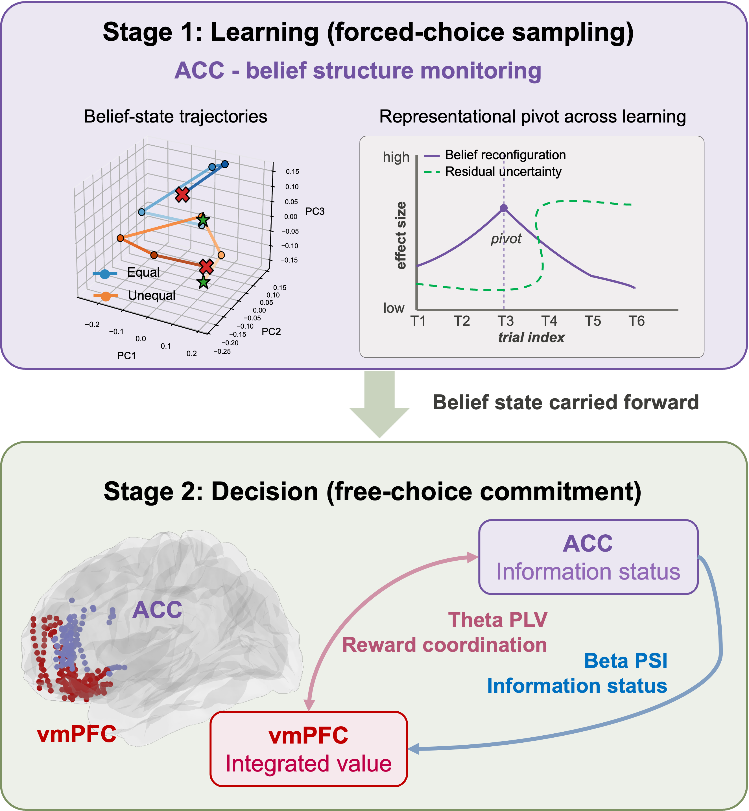

# Prefrontal coordination of belief monitoring and value integration in human exploration

> From [Affective, Neuroscience, and Decision-making Lab](https://andlab-um.com)

## Abstracts
Adaptive decision-making requires integrating reward expectations with information about uncertain options, yet how human prefrontal circuits link belief updating to value-based choice remains unclear. Using intracranial stereoelectroencephalography (SEEG) recordings from vmPFC and ACC in participants performing an explore--exploit task with dissociated reward expectation from sampling-history-dependent information status, we find a clear functional dissociation between the two regions that holds across both learning and choice. 
During choice, vmPFC tracked composite subjective value and carried dissociable reward- and information-related signals, whereas ACC beta activity preferentially reflected information status. Signed beta band ACC--vmPFC phase-slope coupling was modulated by information before choice, indicating temporally ordered prefrontal coordination. 
During learning, ACC population states were organized by evolving belief structure, including belief reconfiguration and alignment with residual uncertainty. 
These findings identify a dynamic prefrontal mechanism linking ACC belief-state monitoring with vmPFC value integration during human exploration.

**Research highlights **
- During choice, vmPFC broadband gamma activity encoded integrated subjective value together with separable reward- and information-related components, whereas ACC beta activity was preferentially sensitive to information status. 
- Beta-band phase-slope analyses revealed an ACC-leading ACC--vmPFC interaction before choice, which suggests a prefrontal coordination rather than independent local coding alone. 
- During the preceding learning phase, ACC population states were preferentially organized by the evolving information structure of the task, including midpoint belief reconfiguration and later, weaker alignment with residual uncertainty. 

* 

About 

This repository contains code and analysis scripts for the study of neural mechanisms underlying flexible reward and information processing in human prefrontal circuits.

**Thank you for your interest!**
